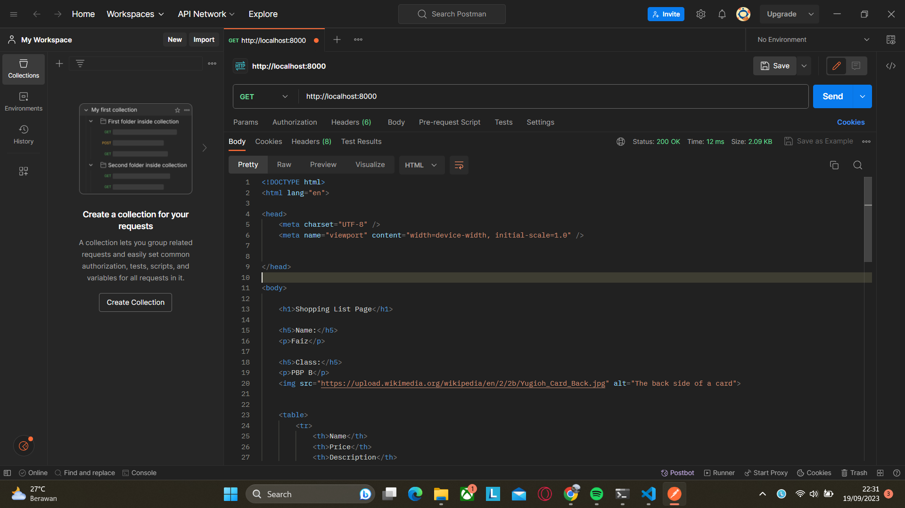
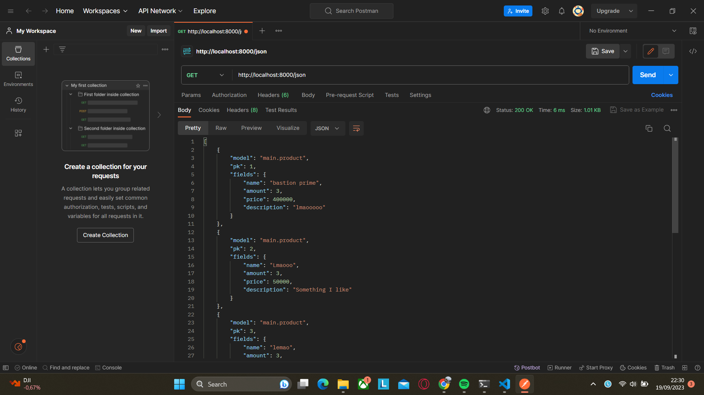
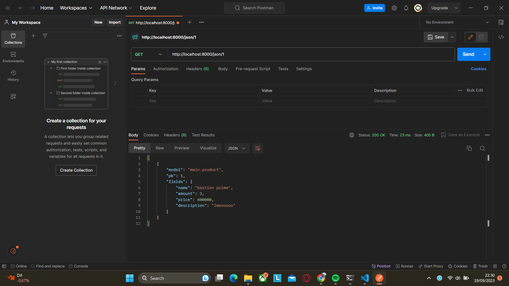
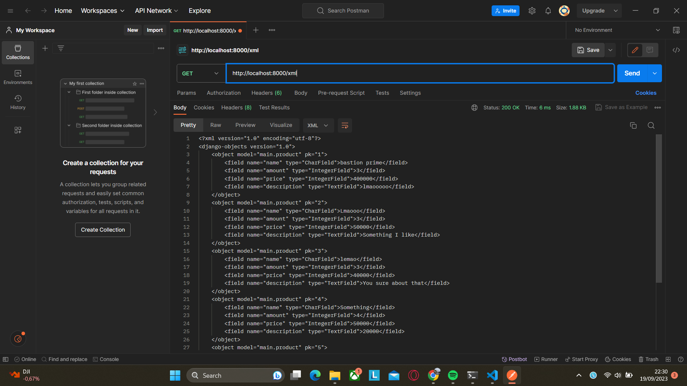
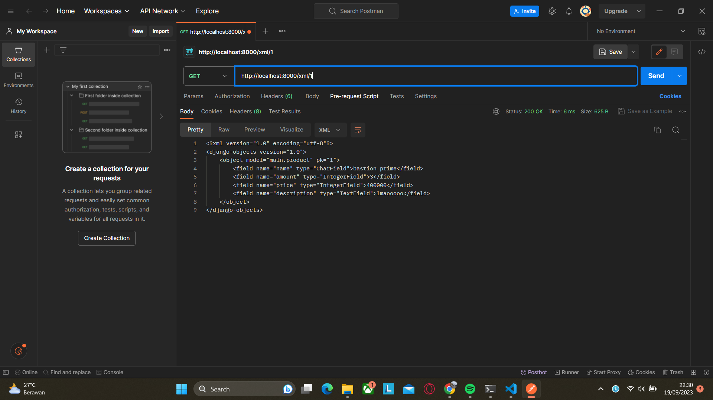
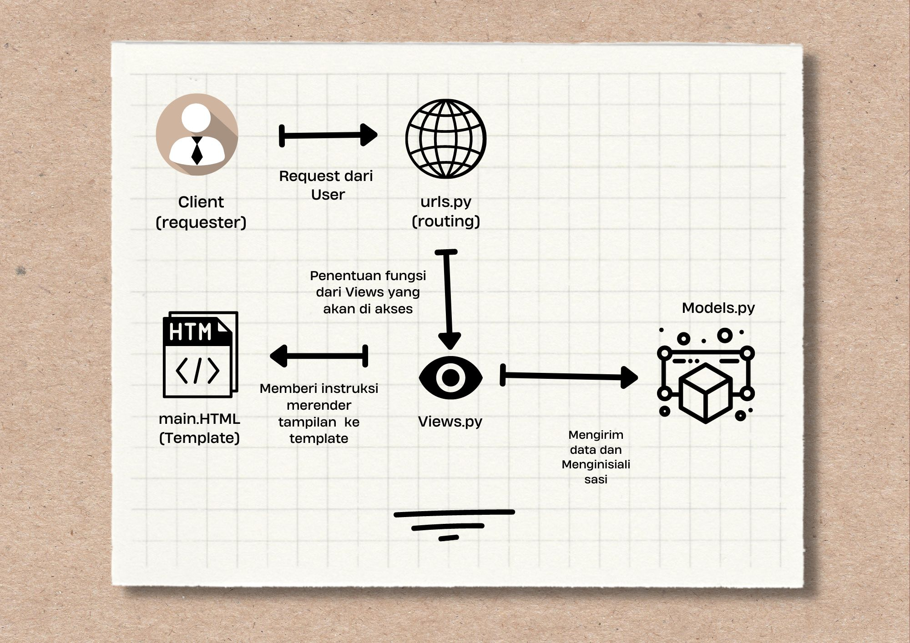

# Tugas3PBP
Tugas 3 pembuatan MVT TCG 


Nama    : Faiz Abdurrachman 

NPM     : 2201233210
     
Kelas   : PBP B


Link Adaptable : 


Jawaban Pertanyaan : 

# 1. Apa perbedaan antara form "POST" dan form "GET" dalam django?
*  Metode Pengiriman data : 
    1. Form POST mengirim data dari forms ke server dengan menyembunyikan data saat permintaan http, sehingga tidak terlihat di url 
    2. Form GET mengirim data sebagai bagian dair URL, sehingga data terlihat dalam URL. 

*   1. Form POST lebih aman untuk mengirim data sensitif karena data tidak terlihat dalam URL dan terlindungi dengan baik.
    2. Form GET kurang aman karena data terlihat dalam URL dan dapat dengan mudah diakses atau disadap oleh pihak ketiga.
            
              
# 2.  Apa perbedaan utama antara XML, JSON, dan HTML dalam konteks pengiriman data?

XML (Extensible Markup Language):
- Digunakan untuk menyimpan dan mentransfer data terstruktur.

JSON (JavaScript Object Notation):
- Digunakan untuk mentransfer data dalam bentuk objek yang terstruktur.

HTML (Hypertext Markup Language):
- Digunakan untuk membuat tampilan halaman web, bukan untuk pertukaran data.

# 3.  Mengapa JSON sering digunakan dalam pertukaran data antara aplikasi web modern?
    
- JSON sering digunakan dalam pertukaran data antara aplikasi web modern karena:

- Ringkas dan Mudah Dibaca: JSON memiliki format yang ringkas dan mudah dibaca oleh manusia, membuatnya ideal untuk pertukaran data antara aplikasi web.

- Objek Terstruktur: JSON memungkinkan representasi data dalam bentuk objek yang terstruktur, yang mirip dengan struktur data dalam bahasa pemrograman, sehingga mudah diolah oleh kode.

- Ringan dan Efisien: JSON memiliki overhead yang minimal, sehingga memungkinkan pertukaran data dengan cepat dan efisien melalui jaringan.

# 4. Jelaskan bagaimana cara kamu mengimplementasikan checklist di atas secara step-by-step 

+ Membuat berkas forms.py untuk dapat menerima produk baru. isi forms dengan fields yang sesuai fields dari model ini, dan definisikan model menjadi objek apa agar saat form disimpan akan membuat objek itu 
+ Kita dapat membuat fungsi dengan pertama membuat variabel yang dipakai untuk menyimpan semua hasil query data yang ada di produk yaitu adalah 
    ```
    data = Product.objects.all()
    return HttpResponse(serializers.serialize("json", data), content_type="application/json")

 return function untuk  HTML, XML, JSON, dapat diganti saat return function serializers. Diganti dengan format yang akan diserialize agar sesuai dengan format yang diinginkan. 

+ Untuk yang show id dilakukan dengan cara mengubah data menjadi

    ```
    data = Product.objects.filter(pk=id)
    return HttpResponse(serializers.serialize("xml", data), content_type="application/xml")
ini dilakukan agar product terfilter agar fungsi menyimpan query dari data dengan id tertentu 
untuk return functionnya sama dengan return function sebelumnya 

+ Terakhir untuk routing url kita menambah sesuai dengan views yang sudah kita buat yaitu 

    ```
    path('', show_main, name='show_main'),
    path('create-product', create_product, name='create_product'),
    path('xml/', show_xml, name='show_xml'), 
    path('json/', show_json, name='show_json'),
    path('xml/<int:id>/', show_xml_by_id, name='show_xml_by_id'),
    path('json/<int:id>/', show_json_by_id, name='show_json_by_id'), 

url akan menerima argumen berupa fungsi views yang akan kita pakai, seperti 
1. 'create-product': Mencocokkan URL dengan create_product view.
2. '<int:id>/': Mencocokkan URL dengan view yang memiliki parameter <int:id> (integer ID).
3. 'show_main', 'show_xml', 'show_json', 'show_xml_by_id', dan 'show_json_by_id': Mencocokkan URL dengan views yang sesuai dengan nama yang disebutkan.

# 5. Screenshot Postman 

1. HTML


2. JSON


3. JSON berdasarkan id


4. XML


5. XML berdasarkan id



# 6 Bonus
saya membuat kode
    
    ```html
        
        <p>Kamu menyimpan {{ total_items }} item pada aplikasi ini.</p>
        

Menggunakan  tag untuk membuat variabel baru di django templates setelah itu di definisikan sebagai jumlah item pada product dengan cara menjumlahkan item di dalam products dengan 'length'.


# TugaS 2 PBP
s

Jawaban Pertanyaan : 

MVC (Model-View-Controller):
1. Penjelasan setiap projek Django : 

# Cek Box 1 

Proses dimulai dengan pertama membuat proyek Django baru, pertama yang dilakukan adalah membuat sebuah repositori git baru untuk menampung proyek aplikasi django. Setelah selesai men-setup repositori di lokal dan di git mulai dengan install Django, karena Django sudah terinstall maka dimulai dengan inisiasi Proyek Django. Ini dimulai dengan membuat direktori dimana aplikasi akan dibuat dan mengaktifkan Virtual Enviroment di Folder tersebut. Setelah itu install dependencies, jika sudah bisa mulai dengan mengaktifkan startproject di command shell

Model       :       Menangani data dan logika bisnis.
View        :       Menampilkan data kepada pengguna.
Controller  :       Mengatur interaksi antara Model dan View.

# Cek Box 2 
membuat aplikasi baru bernama main dengan menjalankan command startapp main.  Setelah itu saat sudah dicek bahwa di folder terdapat folder bernama main masukkan main ke installed apps agar aplikasi dapat dibaca oleh django, setelah itu kita membuat direktori baru bernama templates dalam folder yang berisi direktori main dan di direktori template kita membuat main.HTML yang menjadi pengaturan tampilan HTML dan logika presentasi 

# Cek Box 3
untuk menghubungkan rute url terhadap agar perubahan pada main terlihat kita perlu setup pathingnya di urls.py yang kita akan buat di direktori main 

MVT (Model-View-Template):
# Cek Box 4
Kita dapat membuat model pada aplikasi main dengan cara mengubahnya di models.py dan sesuai dengan ketentuan kita membuat dalam bentuk 

    name = models.CharField(max_length=255)
    amount = models.IntegerField()
    price = models.IntegerField()
    description = models.TextField()

Model       :       Dibanding MVC model-nya lebih difokuskan sebagai objek yang mendefinisikan entitas pada database beserta konfigurasiny
View        :       Menampilkan data kepada pengguna.
Template    :       Mengatur tampilan HTML dan logika presentasi.
    sesuai dengan ketentuan terdapat name amount dan description yang masing masing bersisi charfield, IntegerField, dan TextField

MVVM (Model-View-ViewModel):    
# Cek Box 5
Untuk menentukan fungsi di views untuk dikembalikan ke dalam sebuah template HTML kita membuat dictionary yang berisi data-data yang sesuai kita isi yang akan ditampilkan. di sana terdapat 3 konteks yaitu nama,class,dan title,dimana itu adalah data nama,data kelas,data title. dibawahnya terdapat line return render dan main.HTML yang berarti dia akan merender tampilannya di template main.HTML. Setelah itu di Main.HTML diubah agar output nama dan kelas dan title sesuai dengan views dengan cara mengubah datanya menjadi dictionary yang sudah kita set 

    Model       :       Menangani data dan logika bisnis.
    View        :       Menampilkan data kepada pengguna.
    viewModel   :       Memproses data dari Model agar sesuai dengan kebutuhan tampilan yang diatur oleh View.

# Cek Box 6 

Perbedaan utama adalah bagaimana mereka mengatur interaksi antara komponen-komponen ini, dengan MVC menggunakan Controller, MVT menggunakan Template, dan MVVM menggunakan ViewModel. Pilihan tergantung pada kebutuhan aplikasi dan preferensi pengembang.
seperti tadi kita kembali ke urls.py yang sudah kita buat dan meroutenya agar dia ke ke aplikasi main. Hal ini dengan cara 

    path('', show_main, name='show_main'),

Kaitan antara berkas dalam aplikasi web Django:
hal ini memperlihatkan bahwa dia akan meroute filenya ke path dan meakses show_main dari views.py yang sudah kita edit tadi

urls.py: Mengatur URL dan mengarahkan permintaan klien ke fungsi atau kelas tampilan di views.py.
views.py: Berisi logika bisnis, mengambil data dari models.py, dan mengembalikan respons, seringkali dalam bentuk halaman HTML.
models.py: Mendefinisikan struktur data dan relasi database yang digunakan oleh aplikasi.
Berkas HTML: Digunakan untuk menghasilkan tampilan yang diberikan kepada pengguna, seringkali dengan menggunakan data dari model.
# Cek Box 7 

Mengapa menggunakan virtual environment (lingkungan virtual):
Setelah itu kita mendeploy di adaptable dengan cara membuat repo membuka halaman adaptable dan memilih repo yang tadi kita buat untuk menjadi aplikasi. dan juga memilih branch yang akan dipilih. setelah itu pilih python app template sebagai template dan PostgreSQL sebagai data yang digunakan, terus mengubah versi python sesuai dengan python yang terinstall, masukkan start command yaitu python manage.py migrate && gunicorn car_mart.wsgi. Setelah melakukan step2 diatas kita bisa memberi nama aplikasi dan setelah itu aplikasi sudah siap. 

Memungkinkan isolasi proyek Python, menghindari konflik antar-paket, dan memastikan penggunaan versi paket yang sesuai untuk setiap proyek.
Meskipun mungkin memungkinkan, sangat disarankan untuk menggunakan virtual environment saat mengembangkan aplikasi web Django untuk manajemen yang lebih baik dan kebersihan kode.

2. Kaitan antara berkas dalam aplikasi web Django:



3. Mengapa menggunakan virtual environment (lingkungan virtual):

    Virtual Environtment atau VE banyak fungsinya dan kelebihannya, Seperti memungkinkan isolasi proyek Python, menghindari konflik antar-paket, dan memastikan penggunaan versi paket yang sesuai untuk setiap proyek. Alasan utama pengguanaan virtual environment adalah  dalam pengembangan Python yang membantu Anda mengelola dependensi proyek Anda dengan lebih baik, menjaga isolasi antar proyek, dan memastikan konsistensi dan stabilitas lingkungan pengembangan Anda.


4. Penjelasan MVC,MVT,MVVM, dan perbedaannya

    MVC (Model-View-Controller):

    Model       :       Menangani data dan logika bisnis.
    View        :       Menampilkan data kepada pengguna.
    Controller  :       Mengatur interaksi antara Model dan View.

    MVT (Model-View-Template):

    Model       :       Dibanding MVC model-nya lebih difokuskan sebagai objek yang mendefinisikan entitas pada konfigurasinya
    View        :       Menampilkan data kepada pengguna.
    Template    :       Mengatur tampilan HTML dan logika presentasi.

    MVVM (Model-View-ViewModel):    

    Model       :       Menangani data dan logika bisnis.
    View        :       Menampilkan data kepada pengguna.
    ViewModel   :       Memproses data dari Model agar sesuai dengan kebutuhan tampilan yang diatur oleh View.

    Perbedaan utama adalah bagaimana mereka saling mengatur interaksi antara komponen-komponennya, dengan MVC menggunakan Controller, MVT menggunakan Template, dan MVVM menggunakan ViewModel. Pilihan tergantung pada kebutuhan aplikasi dan preferensi pengembang.


